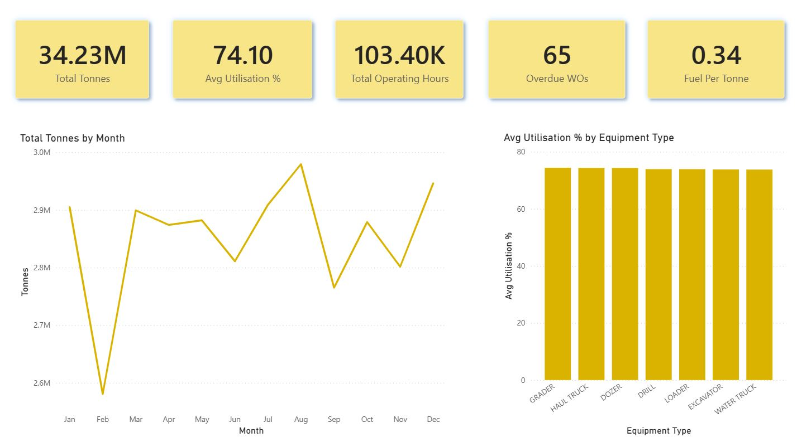

# Data visualisation case studies

This repository contains two small dashboard case studies:

1. A customer churn practice project completed through DataCamp.
2. A personal mining operations project built with synthetic data, Snowflake and Power BI.

The repository documents what is visible in the available screenshots and what I personally built. It does not present the work as production software or professional client delivery.

> **File availability:** Screenshots are provided for demonstration. The original Power BI files are not included.

## Customer churn dashboard

This is my completed dashboard from DataCamp's *Customer Churn Project*. I built the dashboard and its visuals as a practice project. It is not professional client work or a production report.

The overview screenshot displays a reported churn rate, customer and churn counts, churn categories and reasons, contract types, and a map of churn rate by US state. The dataset source is still to be confirmed.

*Customer churn overview from DataCamp's Customer Churn Project. Dataset source to be confirmed.*

[Read the customer churn case study](case-studies/customer-churn-dashboard.md)

## Mining operations dashboard

This is my personal Power BI project using synthetic mining operations data that I generated with AI. I organised the data into bronze, silver and gold layers in Snowflake, then built the dashboard using data from Snowflake.

In plain language:

- The bronze layer holds the data in its initial form.
- The silver layer represents cleaned or prepared data.
- The gold layer provides data arranged for reporting and dashboard use.

The screenshot displays synthetic figures for tonnes, equipment utilisation, operating hours, overdue work orders and fuel per tonne. It also includes monthly tonnes and average utilisation by equipment type.

> **Synthetic data:** All mining figures are synthetic. They do not describe or represent a real mine, company or mining operation.

*Synthetic mining operations dashboard using reporting data from Snowflake.*

[Read the mining operations case study](case-studies/mining-operations-dashboard.md)

## Repository contents

Each case-study page covers:

- the purpose of the project
- the data source
- what I personally built
- what can be seen in the screenshot
- known limitations
- the files available in this repository

Only screenshots and written documentation are currently included. No Power BI report files, SQL scripts or underlying datasets are included. Snowflake SQL and architecture documentation may be considered for a later update after the actual files have been reviewed.

## Use of materials

No licence has been added. Reuse rights for the screenshots and DataCamp-related material have not been granted through this repository.
