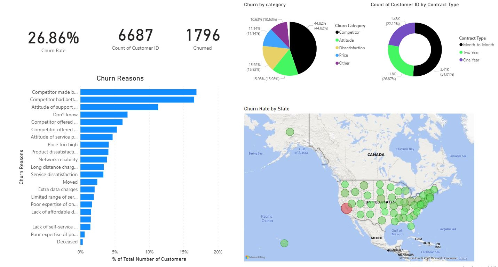

# Customer churn dashboard

## Purpose

This was a sample and practice project completed through DataCamp's *Customer Churn Project*. Its purpose was to practise building and presenting a customer churn dashboard.

This is not professional client work or a production dashboard.

## Data source

The project was completed through DataCamp. The exact dataset source has not yet been confirmed and will be added when known.

- **Project:** DataCamp — *Customer Churn Project*
- **Dataset source:** To be confirmed

## What I built

I completed the full dashboard myself, including the dashboard layout and visuals, as part of the DataCamp practice project. The screenshot is of my completed work rather than a supplied solution.

No further claims are made here about the data preparation, model, calculations or methods because the original Power BI file is not available for review.

## What the screenshot shows

The overview page displays:

- a reported churn rate of 26.86%
- 6,687 customers and 1,796 churned customers
- churn grouped by category
- customer counts grouped by contract type
- a ranked chart of churn reasons
- churn rate by US state on a map

These are figures displayed in the screenshot. This repository does not independently verify their calculations or source data.

*Overview page from my completed DataCamp Customer Churn Project. Dataset source to be confirmed.*

## Limitations

- The work was completed as a DataCamp practice project, not for a client or production environment.
- The exact dataset source is still to be confirmed.
- Only a static screenshot is available, so interactions and filters cannot be demonstrated.
- The original Power BI file is not included.
- No underlying data, formulas, measures, queries or code are available in this repository.

## Files available

- [`customer-churn-overview.jpg`](../images/customer-churn-overview.jpg) — screenshot of the dashboard overview
- This case-study page

[Return to the main README](../README.md)
